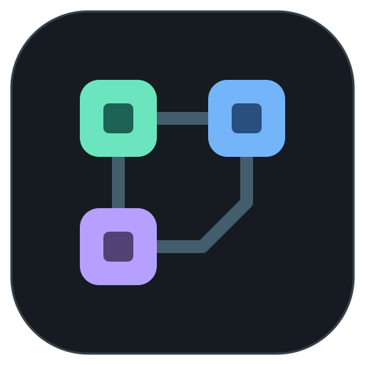
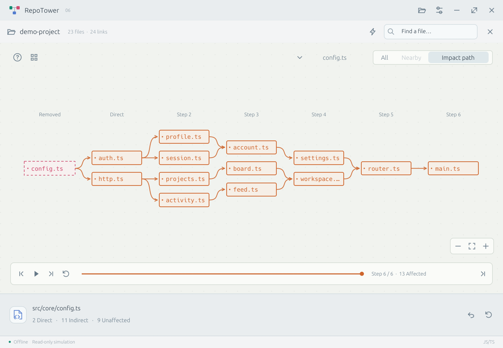

<p align="center"></p>

# RepoTower

A small, offline **native Rust desktop app** for exploring source dependencies. Disconnect a file and follow its potential impact through an interactive 2D graph.

[](https://github.com/cabal312512/RepoTower/actions/workflows/build.yml)
[](https://github.com/cabal312512/RepoTower/releases/latest)
[](LICENSE)

[Download](https://github.com/cabal312512/RepoTower/releases/latest) · [简体中文](docs/README.zh-CN.md) · [Language support](docs/LANGUAGES.md) · [Contributing](CONTRIBUTING.md)


## Download

| Platform | Download | Start |
| --- | --- | --- |
| Windows x64 | `RepoTower-0.6.0-windows-x64.exe` | Save in a writable folder and open. This is the application itself. |
| Windows x64, with documentation | `RepoTower-0.6.0-windows-x64-portable.zip` | Extract; open `RepoTower.exe`. |
| macOS Apple Silicon | `RepoTower-0.6.0-macos-arm64.zip` | Extract; open `RepoTower.app`. |
| macOS Intel | `RepoTower-0.6.0-macos-x64.zip` | Extract; open `RepoTower.app`. |
| Linux x64 | `RepoTower-0.6.0-linux-x64.tar.gz` | Extract; run `./RepoTower`. |

The Windows EXE runs on its own: **no Electron, Chromium, WebView2, Node.js or language SDK installation**, and no application payload extraction. Fonts, examples, analysis grammars and the interface are embedded. The app runs offline and never executes the project being inspected.

Preferences, temporary files and embedded examples are kept in `runtime-data` beside the executable (beside the `.app` on macOS). Use a writable folder. This describes application-managed files; the operating system and graphics driver may maintain their own records and caches.

Releases include `SHA256SUMS.txt` and source archives. Windows binaries are unsigned; macOS apps are ad-hoc signed, **not notarized**. See [platform requirements and distribution notes](docs/DISTRIBUTION.md).

## Explore

1. Open or drop a source folder, or try an embedded example.
2. Select a file. Arrows run **from a dependency to the files that use it**.
3. Choose **Disconnect** to watch the actual dependency paths propagate. Pause, step, scrub or replay the result.
4. Select any disconnected file again to restore it. Other cuts remain active. Use Undo or Restore all when needed.

In **All**, hold the right mouse button to move a file; its lines and arrows follow. Reset the selected position or every position from the grid button. Drag the background to pan, scroll to zoom, and press **R** to fit. Selection preserves the camera. Double-click a file for **Nearby**. **Impact path** and its history selector keep earlier cut results accessible.

The **?** button contains the guide. Settings offer light/dark appearances, English/简体中文/日本語 and reduced motion. New profiles start in **English and light mode**. Keyboard shortcuts include Ctrl/Cmd+O, Ctrl/Cmd+Z, R, Space and Delete.



## Supported source

JavaScript / TypeScript, Java, Python, C / C++, Go, Rust and C# use built-in Tree-sitter grammars and language-specific local resolution. No Python, JDK, .NET, Go or Rust toolchain is needed to analyze a project.

This is a **static dependency simulation**, not proof of a runtime crash. Unresolved or ambiguous references remain visible as diagnostics. Build-generated sources, reflection, macros and framework behavior have limits; see the [language support table](docs/LANGUAGES.md).

Large projects are analyzed with bounded resource limits. The overview renders up to 250 files; search can reveal files outside that overview. Analysis notes report skipped or partially scanned content.

## Build

Use Rust 1.90, a native C compiler and Node.js 24+ for asset preparation and packaging. Initial builds download dependencies; the released app needs no network connection.

```sh
npm ci
node scripts/build-native.mjs
node scripts/test-native.mjs --packaged
node scripts/distribute.mjs
```

Windows can use `powershell -NoProfile -ExecutionPolicy Bypass -File scripts/build.ps1`, which bootstraps a project-local Rust/GCC toolchain. Nothing needs to be installed globally. See [portable toolchain setup](docs/PORTABLE-TOOLCHAIN.md).

The runtime lives in `crates/repotower-desktop` (egui / wgpu) and links `crates/repotower-core` directly. Node only runs development, tests and packaging. See [architecture](docs/ARCHITECTURE.md), [validation](docs/VALIDATION.md) and [contributing](CONTRIBUTING.md).

## License

[MIT](LICENSE). Third-party components and embedded fonts retain their own licenses, available in Settings → Licenses and [THIRD_PARTY_NOTICES.md](THIRD_PARTY_NOTICES.md).

The previous Electron implementation remains available in [v0.5.0](https://github.com/cabal312512/RepoTower/releases/tag/v0.5.0).
