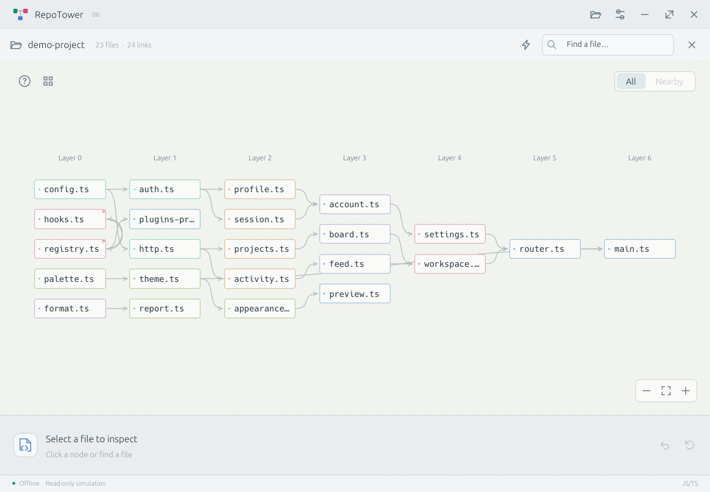

# RepoTower

一个小巧、离线的 **Rust 原生桌面依赖分析工具**。选中文件，模拟断开，沿真实连线观察哪些文件可能受到影响。

[下载最新版本](https://github.com/cabal312512/RepoTower/releases/latest) · [English](../README.md) · [语言支持与限制](LANGUAGES.md)

## 下载

| 平台 | 文件 |
| --- | --- |
| Windows x64，单文件程序 | `RepoTower-0.6.0-windows-x64.exe` |
| Windows x64，附带说明文档 | `RepoTower-0.6.0-windows-x64-portable.zip` |
| macOS Apple Silicon | `RepoTower-0.6.0-macos-arm64.zip` |
| macOS Intel | `RepoTower-0.6.0-macos-x64.zip` |
| Linux x64 | `RepoTower-0.6.0-linux-x64.tar.gz` |

Windows 的 EXE 就是程序本身，放在可写文件夹中即可运行。无需安装 Electron、Chromium、WebView2、Node.js 或任何语言开发环境，也不需要解压一套浏览器运行时。字体、示例和语法解析器均已内置，断网可用。

程序管理的设置、缓存、临时文件和示例保存在程序旁边的 `runtime-data` 文件夹中；macOS 保存在 `.app` 旁边。操作系统或显卡驱动自身的记录和缓存不由应用控制。

Release 附带 SHA-256 校验文件和源码压缩包。Windows 文件尚未签名；macOS 使用临时签名，尚未公证。详见[发布说明](DISTRIBUTION.md)。

## 使用

1. 打开或拖入项目文件夹，也可直接试用内置示例。
2. 点击文件查看引用与使用者。箭头从依赖指向使用它的文件。
3. 点击“断开文件”，观察影响沿真实依赖连线传播；可以暂停、单步、拖动进度和重播。
4. 随时重新选中已断开的文件并恢复。多次断开时，恢复其中一个不会错误地消除其他断开的影响。

“全部”视图中，按住鼠标右键拖动节点，连线和箭头跟随。网格按钮可还原选中节点或全部节点的位置。拖动空白平移，滚轮缩放，R 适应画布；点击节点不重置镜头。双击节点进入“相邻”。“影响路径”及其记录菜单可随时回看。

教程位于 **?** 按钮。设置支持日间 / 夜间、English / 简体中文 / 日本語和减少动态效果。首次打开默认英文、日间模式。

支持 JS/TS、Java、Python、C/C++、Go、Rust、C#，无需安装这些语言的 SDK。程序不执行项目源码、不上传仓库，也不会真的删除或修改断开的文件。模拟的是静态依赖上的潜在影响，无法代替运行测试。解析范围与限制见[语言说明](LANGUAGES.md)。

## 开发与旧版

构建需 Rust 1.90、C 编译器和 Node.js 24+。Windows 可运行 `scripts/build.ps1`，工具链和下载缓存均放在项目内。详见[工具链说明](PORTABLE-TOOLCHAIN.md)、[架构](ARCHITECTURE.md)和[验证记录](VALIDATION.md)。

使用 MIT License。第三方依赖及字体许可证可在设置中查看。旧 Electron 版继续保留在 [v0.5.0](https://github.com/cabal312512/RepoTower/releases/tag/v0.5.0)。
